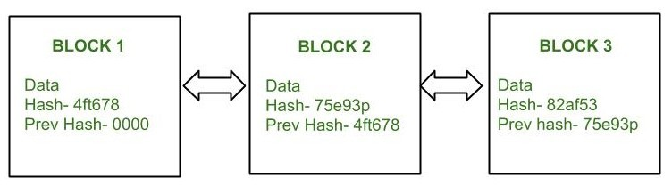
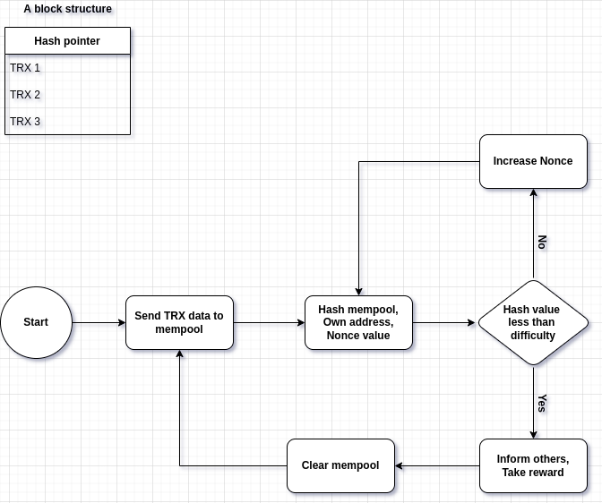

# Bitcoin Consensus mechanism: Proof of Work

There are different type of solutions for __consensus mechanism__ such as proof-of-work (PoW), proof-of-stake (PoS), practical byzantine fault-tolerance (PBFT), delegated proof-of-stake (DPOS).

Bitcoin uses proof-of-work as a solution of consensus mechanism. The Bitcoin consensus is about transaction rules, transaction states and Bitcoin values.

This is structure of each network block. each node tries to create a new block by their it mempool, so it takes Data (Transactions), a hash pointer which contains previous hash, and own hash, and a nonce value and give this information to a hash function (SHA-256), If the value of the function is less than the network difficulty, that means it worked a lot to find the hash, so the network gives some rewards to that node.

__PoW__ as a Flowchart.

